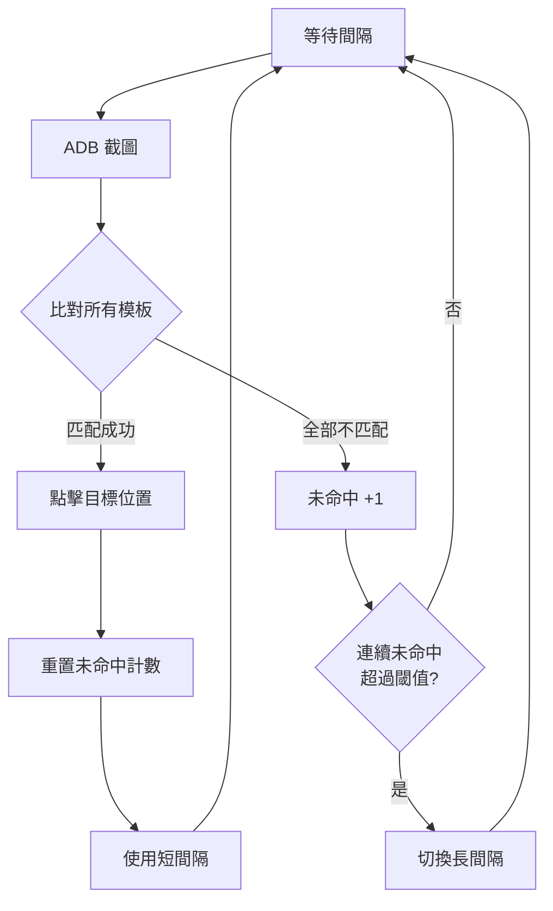

# sbss

Android 模擬器自動掛機工具。透過 ADB 截圖辨識畫面，自動點擊。



## 下載

**Windows**：從 [Releases](https://github.com/ccc1348/sbss/releases) 下載，解壓縮執行 `sbss.exe`

**Mac/Linux**：見底部[開發者](#開發者)區塊

## 快速開始

1. **開啟模擬器**（BlueStacks、LDPlayer、夜神等），進入遊戲
2. **啟用 ADB**：模擬器設定中開啟 Android Debug Bridge
3. **執行 sbss**，自動開啟瀏覽器

## 使用流程

### 建立腳本

1. 點擊 `+ 新增腳本`，輸入名稱
2. 進入腳本後，點擊 `+ 新增步驟`

### 錄製步驟

每個步驟 = 「看到這個畫面 → 點這裡」

1. **截圖**：擷取當前 BlueStacks 畫面
2. **選區域**：框選要辨識的特徵區域（按鈕、圖示等）
3. **選點擊位置**：指定匹配成功後要點哪裡
4. **儲存**

### 運行

1. 選擇設備（多開時會有多個）
2. 點擊 `啟動`
3. 程式會循環截圖 → 比對 → 點擊

## 設定說明

| 設定 | 說明 | 預設 |
|------|------|------|
| 解析度 | BlueStacks 解析度 (寬x高) | 1080x1920 |
| 相似度閾值 | 多像才算匹配 (0-1) | 0.8 |
| 短間隔 | 正常檢測間隔 (秒) | 0.8 |
| 長間隔 | 閒置時檢測間隔 (秒) | 10 |
| 點擊延遲 | 點擊後等待範圍 (秒) | 0.8-1.5 |

## 多開支援

模擬器多開時，每個實例自動偵測：
- 下拉選單選擇要控制的實例
- 可同時開多個 sbss 視窗控制不同實例

## 常見問題

**Q: 找不到設備？**
確認模擬器已啟用 ADB

**Q: 截圖失敗？**
重啟模擬器，或嘗試重新連接 ADB

**Q: 匹配不到？**
- 調低相似度閾值
- 選擇更獨特的特徵區域
- 確認模擬器解析度與設定一致

## 開發者

```bash
# 安裝
python -m venv venv
./venv/bin/pip install -r requirements.txt

# 運行
./venv/bin/python web.py
```
