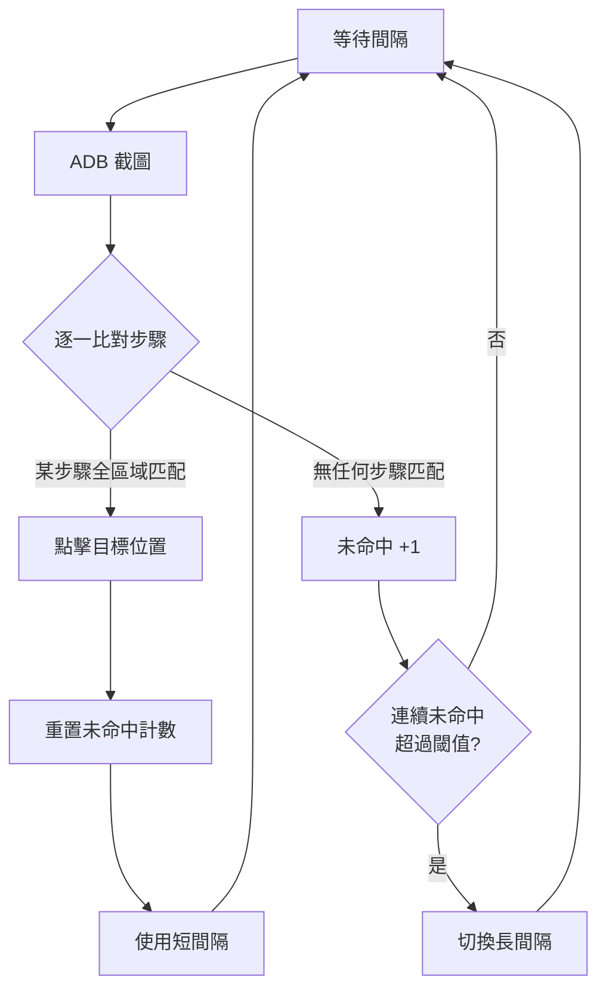

# sbss

Android 模擬器自動掛機工具。透過 ADB 截圖辨識畫面，自動點擊。



## 下載

**Windows**：從 [Releases](https://github.com/ccc1348/sbss/releases) 下載，解壓縮執行 `sbss.exe`

**Mac/Linux**：見底部[開發者](#開發者)區塊

## 快速開始

1. **開啟模擬器**（BlueStacks、LDPlayer、夜神等），進入遊戲
2. **啟用 ADB**：模擬器設定中開啟 Android Debug Bridge
3. **執行 sbss**，自動開啟操作視窗（關閉視窗會自動停止運行）

## 使用流程

### 建立腳本

1. 點擊 `+ 新增腳本`，輸入名稱
2. 進入腳本後，點擊 `+ 新增步驟`

### 錄製步驟

每個步驟 = 「看到這個畫面 → 點這裡」

1. **截圖**：擷取當前 BlueStacks 畫面
2. **選區域**：框選要辨識的特徵區域（按鈕、圖示等）
3. **選點擊位置**：指定匹配成功後要點哪裡
4. **儲存**

### 運行

1. 選擇設備（多開時會有多個）
2. 點擊 `啟動`
3. 程式會循環截圖 → 比對 → 點擊

## 運作原理

### 比對模式

**一般模式（預設）**
- 每次截圖後，從第一個步驟開始逐一比對
- 哪個步驟先匹配成功，就執行哪個
- 適合：畫面順序不固定、隨機事件處理

**順序模式**
- 必須按步驟順序執行，上一步完成才會比對下一步
- 如果中間有步驟標記為「可略過」，會一起納入比對範圍
- 適合：固定流程、需要嚴格按順序操作的場景

### 比對機制

- **相似度判定**：畫面與步驟截圖相似度達 80% 視為匹配成功
- **檢測頻率**：每 0.5 秒比對一次（可調整）
- **省電模式**：連續 5 次都沒匹配到，自動放慢到每 5 秒一次；一旦又匹配成功，恢復正常頻率
- **擬人點擊**：匹配成功後，點擊前會隨機延遲 0.2~1.2 秒，避免太像機器人

## 設定說明

| 設定 | 說明 | 預設 |
|------|------|------|
| 解析度 | 模擬器解析度 (寬x高) | 1080x1920 |
| 相似度閾值 | 多像才算匹配 (0~1) | 0.8 |
| 短間隔 | 正常檢測間隔 (秒) | 0.5 |
| 長間隔 | 閒置時檢測間隔 (秒) | 5 |
| 未命中閾值 | 連續幾次未匹配後切換長間隔 | 5 |
| 點擊延遲 | 點擊前隨機延遲範圍 (秒) | 0.2~1.2 |

## 多開支援

```
模擬器 1 ←── sbss 視窗 1 ──┐
模擬器 2 ←── sbss 視窗 2 ──┼── 共用腳本
模擬器 3 ←── sbss 視窗 3 ──┘
```

- 開幾個模擬器，就開幾個 sbss
- 每個視窗頂部選擇要控制的設備
- 腳本通用，不用重複錄製

## 常見問題

**Q: 找不到設備？**
確認模擬器已啟用 ADB

**Q: 截圖失敗？**
重啟模擬器，或嘗試重新連接 ADB

**Q: 匹配不到？**
- 調低相似度閾值
- 選擇更獨特的特徵區域
- 確認模擬器解析度與設定一致

## 開發者

```bash
# 安裝
python -m venv venv
./venv/bin/pip install -r requirements.txt

# 運行
./venv/bin/python web.py
```
